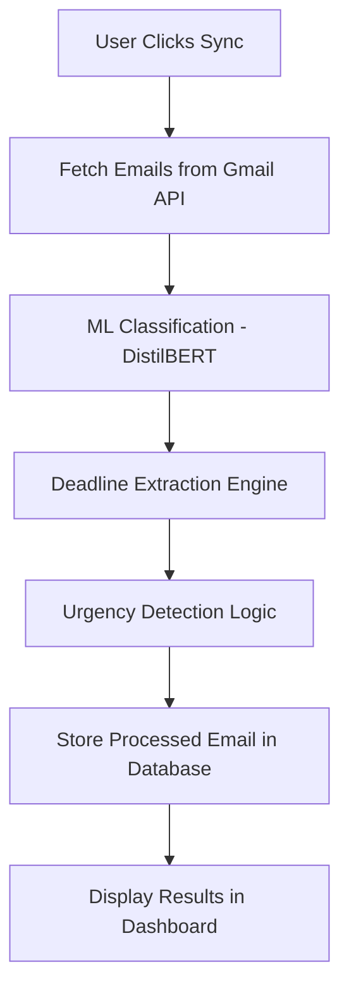

# Smart Email Sorting System

A Machine Learning Approach for Enhanced Productivity
## Project Overview

The **Smart Email Sorting System** is an AI-powered web application that automatically:

* Classifies incoming emails using a fine-tuned DistilBERT model
* Detects deadlines from email content
* Calculates remaining days
* Automatically marks urgent emails
* Provides role-based dashboards (User & Admin)
* Integrates Gmail via OAuth
* Ensures secure multi-user isolation

This system reduces information overload and enhances productivity by intelligently organizing emails beyond traditional rule-based filtering.

# System Architecture

### Backend (FastAPI)

* Authentication (JWT)
* Gmail OAuth Integration
* Email Classification Pipeline
* Deadline Extraction Engine
* Database Layer (SQLAlchemy + PostgreSQL/Supabase)

### Frontend (React)

* Login Page
* Dashboard (User/Admin)
* Gmail Connection UI
* Sync Button
* Email Table View
* Deadline Alerts

# Core Features

## 1️. Authentication System

* User Registration
* User Login (OAuth2 Password Flow)
* JWT Token-based authentication
* Role-based access control (Admin/User)

## 2️. Gmail OAuth Integration

* Secure Google OAuth flow
* Gmail account connection
* Access token storage
* Automatic sync after connection

## 3️. AI Email Classification

* Model: DistilBERT (Transformer-based)
* Input: Subject + Body
* Output:

  * Category
  * Confidence score

## 4️. Deadline Intelligence Engine

* Regex-based date extraction
* Supports formats:

  * DD/MM/YYYY
  * YYYY-MM-DD
  * 12 Feb 2026
* Calculates:

  * `deadline_date`
  * `days_remaining`
  * `is_overdue`
* Auto-marks urgent if ≤ 2 days remaining

## 5. Multi-User Isolation

* Each email linked with `user_id`
* Unique constraint: `(email_id, user_id)`
* Users can only view their own emails
* Admin can view global statistics

## 6. Dashboard Analytics

### User Dashboard

* Upcoming Deadlines
* Overdue Alerts
* Gmail Connection Status
* Sync Emails Button
* Categorized Email Table

### Admin Dashboard

* Total Emails
* Urgent Emails
* Category Distribution


# Database Models

## Email Model

* id
* email_id (unique per user)
* user_id (Foreign Key)
* sender
* subject
* body
* category
* confidence
* urgent
* deadline_date
* days_remaining
* is_read
* created_at

## User Model

* id
* email
* hashed_password
* role
* gmail_email
* gmail_access_token
* gmail_refresh_token
* gmail_token_expiry

## 🔁 Email Processing Pipeline




# Installation Guide (End-to-End Setup)

## Step 1 — Clone Repository

```bash
git clone https://github.com/yaswinipriyas24/smartemailsorting.git
cd SMART_EMAIL_SORTING
```

## Step 2 — Backend Setup

### Create Virtual Environment

```bash
python -m venv venv
venv\Scripts\activate   # Windows
```

### Install Dependencies

```bash
pip install -r requirements.txt
```

## Step 3 — Environment Variables

Create `.env` file in root:

```
SECRET_KEY=your_jwt_secret
DATABASE_URL=your_database_url
```

⚠️ Do NOT commit `.env` or `credentials.json`.

## Step 4 — Google OAuth Setup

1. Go to Google Cloud Console
2. Create OAuth Client
3. Download `credentials.json`
4. Place it inside:

```
backend/credentials.json
```

5. Add redirect URI:

```
http://127.0.0.1:8000/gmail/callback
```

## Step 5 — Run Backend

```bash
uvicorn backend.main:app --reload
```

Open:

```
http://127.0.0.1:8000/docs
```

## Step 6 — Frontend Setup

```bash
cd frontend
npm install
npm start
```

Frontend runs at:

```terminal
http://localhost:3000
```

# Security Considerations

* JWT-based authentication
* Role-based authorization
* Gmail OAuth tokens stored securely
* Sensitive files excluded via `.gitignore`
* Unique email-user constraint prevents duplication

# MLOps Lifecycle (Production-Ready)

This project now includes an in-repo MLOps lifecycle for the TF-IDF production model:

1. Data validation
2. Training
3. Evaluation (accuracy + macro F1)
4. Model registry update (`backend/artifacts/registry.json`)
5. Conditional promotion to production

## Run Full MLOps Cycle

```bash
python -m backend.mlops.pipeline --min-f1 0.60
```

PowerShell helper:

```powershell
./scripts/run_mlops_cycle.ps1
```

Outputs:

* Model artifacts: `backend/artifacts/models/<run_id>/`
* Registry: `backend/artifacts/registry.json`
* Last report: `backend/artifacts/last_mlops_report.json`

## Inference Model Selection

`backend/ml_model.py` now loads the promoted production model from the registry.

Optional env flag:

* `MODEL_BACKEND=tfidf` (default, recommended)
* `MODEL_BACKEND=transformer` (attempts transformer load; falls back to TF-IDF)

# Technologies Used

### Backend

* FastAPI
* SQLAlchemy
* PostgreSQL / Supabase
* TensorFlow
* Transformers (DistilBERT)
* Google Gmail API

### Frontend

* React
* Axios
* React Router
* CSS

# Future Improvements

* Background task queue (Celery)
* Token auto-refresh logic
* Email sentiment analysis
* Real-time notifications
* Power BI dashboard export
* Docker deployment

# Celery + Redis (Async Email Sync)

The project now supports asynchronous Gmail sync using Celery workers backed by Redis.

## Docker services

`docker-compose.yml` includes:

* `redis` (broker/result backend)
* `celery_worker` (executes queued sync tasks)

Start stack:

```bash
docker compose up -d --build
```

## Async API endpoints

Queue sync job:

```http
POST /sync-emails/async?limit=20&clear_db=false
```

Check task status:

```http
GET /sync-emails/tasks/{task_id}
```

States include: `PENDING`, `STARTED`, `SUCCESS`, `FAILURE`.

# Problem Statement Addressed

Traditional email systems rely on:

* Chronological sorting
* Rule-based filters

This system improves by:

* Context-aware classification
* AI-based prioritization
* Deadline intelligence
* Multi-user isolation
* Analytics-driven dashboard


# Project Status

[X] Authentication Complete <br>
[X] ML Classification Complete <br>
[X] Deadline Detection Complete <br>
[X] Gmail OAuth Integrated <br>
[X] profile page <br>
[X] Register Page <br>
[X] Admin Interface <br>
[X] User Interface <br>
[X] Multi-user Architecture Stable <br>
[X] Dashboard Visualization Implemented <br>
[ ] Review Ready


# Developed By
|Name|Reg.No|
|----|------|
|**Indrasena Reddy Bala**|22X41A4210|
|**Bulla Vijay kumar**|22X41A4214|
|**Rajulapati Uday Malleshwar**|22X41A4245|
|**Yaswinipriya Sesetti**|22X41A4247|

AI-ML Department
2022-2026
